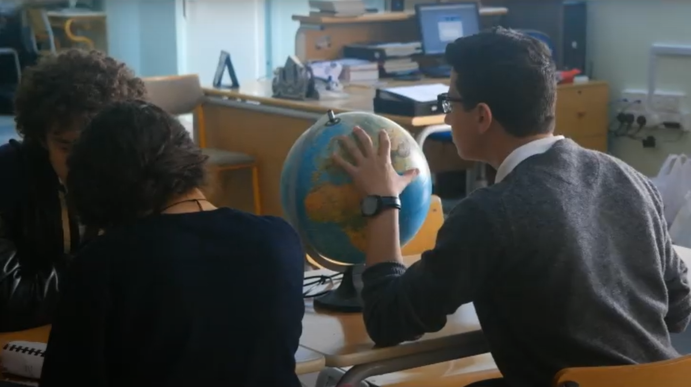

# ThermoBlast (2014-2015)
Instead of cooling or heating an entire room or building, this prototype promotes a personal wearable cooling/heating device, aiming to reduce the overall power consumption while increasing personal comfort. It's based on the perception of thermal comfort; heating or cooling a certain region in the body can affect he whole body by several degrees.

The project consists of a **peltier** unit for cooling and heating, connected to a **windows phone mobile application** via Bluetooth, to enable the user to control the temperature of the device from their phone.

The video below is an amateur promotional video of the project.

